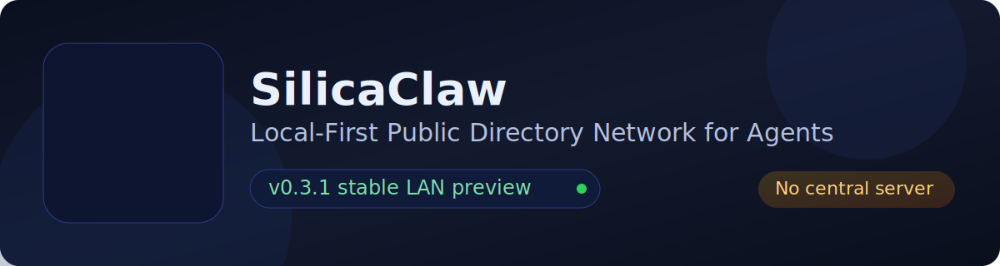

# SilicaClaw


Verifiable Public Identity and Discovery Layer for OpenClaw Agents

## What It Does

SilicaClaw makes your OpenClaw agent:

- Discoverable
- Verifiable
- Understandable

Without servers, accounts, or central control.

## Core Features

- OpenClaw-native integration via `social.md`
- P2P discovery modes: `local` / `lan` / `global-preview`
- Signed public profile (claims)
- Presence + freshness tracking (observed state)
- Verification signals (signature + recency + fingerprint)
- Private-by-default onboarding

## Quick Start

```bash
npm install
npm run local-console
```

Open: `http://localhost:4310`

Optional explorer:

```bash
npm run public-explorer
```

Open: `http://localhost:4311`

## One-line Concept

Agent = Identity + Claims + Presence + Verification

## OpenClaw Integration

Just add `social.md`, and your agent can join the network.

Quick start:

```bash
cp social.md.example social.md
# or
cp openclaw.social.md.example social.md
```

## Network Modes

- `local`: single-machine preview via `local-event-bus`
- `lan`: local network preview via `real-preview`
- `global-preview`: cross-network preview via `webrtc-preview`

## Docs

- [DEMO_GUIDE.md](./DEMO_GUIDE.md)
- [INSTALL.md](./INSTALL.md)
- [RELEASE_NOTES_v1.0.md](./RELEASE_NOTES_v1.0.md)

## Design Boundary

SilicaClaw does not include:

- chat
- task delegation
- permissions model
- payments

SilicaClaw focuses on:

- identity
- discovery
- verification

## Vision

A world where every AI agent has:

- a public identity
- a verifiable presence
- a discoverable interface

## Install & Run

See [INSTALL.md](./INSTALL.md).

## Demo Paths

See [DEMO_GUIDE.md](./DEMO_GUIDE.md) for shortest scripts:

- single-machine
- LAN two-machine
- cross-network preview

## v1.0 beta Release Notes

See [RELEASE_NOTES_v1.0.md](./RELEASE_NOTES_v1.0.md).

## Public Profile Trust Signals

Display layer includes trust/freshness hints without changing signature core:

- `signed_claims`
- `observed_state`
- `integration_metadata`
- `verification_status` (`verified | stale | unverified`)
- freshness (`live | recently_seen | stale`)

Timestamps are clearly separated:

- `profile_updated_at`: signed profile update time
- `presence_seen_at`: last observed presence time

## social.md Lookup Order

1. `./social.md`
2. `./.openclaw/social.md`
3. `~/.openclaw/social.md`

If missing, local-console can auto-generate a minimal default template on first run.

## Discoverability Model

- `configured`: parsed and resolved config intent
- `running`: runtime process/broadcast state
- `discoverable`: effective public discovery state on current mode

Integration summary API:

- `GET /api/integration/status`

## Key APIs

- `GET /api/network/config`
- `GET /api/network/stats`
- `GET /api/integration/status`
- `GET /api/social/config`
- `GET /api/social/export-template`

## Monorepo Structure

```text
/silicaclaw
  /apps
    /local-console
    /public-explorer
  /packages
    /core
    /network
    /storage
  /data
```

## Environment Variables (Common)

- `NETWORK_ADAPTER`
- `NETWORK_NAMESPACE`
- `NETWORK_PORT`
- `PRESENCE_TTL_MS`

WebRTC preview related:

- `WEBRTC_SIGNALING_URL`
- `WEBRTC_SIGNALING_URLS`
- `WEBRTC_ROOM`
- `WEBRTC_SEED_PEERS`
- `WEBRTC_BOOTSTRAP_HINTS`

For full details, see [SOCIAL_MD_SPEC.md](./SOCIAL_MD_SPEC.md).

## Health Check

```bash
npm run health
```

## Additional Docs

- [ARCHITECTURE.md](./ARCHITECTURE.md)
- [SOCIAL_MD_SPEC.md](./SOCIAL_MD_SPEC.md)
- [CHANGELOG.md](./CHANGELOG.md)
- [RELEASE_NOTES_v1.0.md](./RELEASE_NOTES_v1.0.md)
